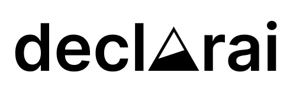

# Introducing declareai
[](https://github.com/vendi-ai/declarai)
[](https://github.com/vendi-ai/declarai/blob/main/LICENSE)



Using AI in your code shouldn't be difficult. Supporting the mission of bringing AI to the masses,
this repo is meant to abstract the know-how of prompt engineering and make using LLMs for daily programming accessible to everyone.

If you know how to write python code and have written any doc-string in your life, this should be a breeze.

## Installation
```bash
pip install declarai
```

## Setup
```bash
export DECLARAI_OPENAI_API_KEY=<your openai token>
```
or pass the token when initializing the declarai object
```python
from declarai import Declarai

declarai = Declarai(provider="openai", model="gpt-3.5-turbo", openai_token="<your-openai-key>")
```

## Usage:
The most basic functionality. Just add the `@task` decorator to your function, add some documentation and you're good to go!
```python
from declarai import Declarai

declarai = Declarai(provider="openai", model="gpt-3.5-turbo")

@declarai.task
def generate_poem(title: str) -> str:
    """
    Write a 4 line poem on the provided title
    """


res = generate_poem(
    title="Declarai, the declarative AI framework for LLMs"
)
print(res)
# Declarai, the AI framework,
# Empowers LLMs with declarative power,
# Efficiently transforming data and knowledge,
# Unlocking insights in every hour.
```
Not the best poem out there, but hey! You've written your first declarative AI code!

Declarai aims to promote clean and readable code by enforcing the use of doc-strings and typing.
The resulting code is readable and easily maintainable.

## Features

### Tasks with python native output parsing:

Python primitives
```python
@declarai.task
def rank_by_severity(message: str) -> int:
    """
    Rank the severity of the provided message by it's urgency.
    Urgency is ranked on a scale of 1-5, with 5 being the most urgent.
    :param message: The message to rank
    :return: The urgency of the message
    """


print(rank_by_severity(message="The server is down!"))
#> 5
print(rank_by_severity(message="How was your weekend?"))
#> 1
```

Python complex objects
```python
@declarai.task
def datetime_parser(raw_date: str) -> datetime:
    """
    Parse the input into a valid datetime string of the format YYYY-mm-ddThh:mm:ss
    :param raw_date: The provided raw date
    :return: The parsed datetime output
    """


print(datetime_parser(raw_date="Janury 1st 2020"))
#> 2020-01-01 00:00:00
```

pydantic models
```python
class Animal(BaseModel):
    name: str
    family: str
    leg_count: int


@declarai.task
def suggest_animals(location: str) -> Dict[int, List[Animal]]:
    """
    Create a list of numbers from 0 to 5
    for each number, suggest a list of animals with that number of legs
    :param location: The location where the animals can be found
    :return: A list of animal leg count and for each count, the corresponding animals
    """


print(suggest_animals(location="jungle"))
#> {
#       0: [
#           Animal(name='snake', family='reptile', leg_count=0)
#       ], 
#       2: [
#           Animal(name='monkey', family='mammal', leg_count=2), 
#           Animal(name='parrot', family='bird', leg_count=2)
#       ], 
#       4: [
#          Animal(name='tiger', family='mammal', leg_count=4), 
#          Animal(name='elephant', family='mammal', leg_count=4)
#       ]
# }
```


### Simple Chat interface
```python
@declarai.experimental.chat
class CalculatorBot:
    """
    You a calculator bot,
    given a request, you will return the result of the calculation
    """

    def send(self, message: str) -> int: ...


calc_bot = CalculatorBot()
print(calc_bot.send(message="1 + 1"))
#> 2
```

To read more about what you can do with Declarai, 
please visit our documentation site: [docs](https://vendi-ai.github.io/declarai/)

## Contributing
We welcome contributions to Declarai! Please read our [contributing guide](https://vendi-ai.github.io/declarai/src/contribute/) to get started.
