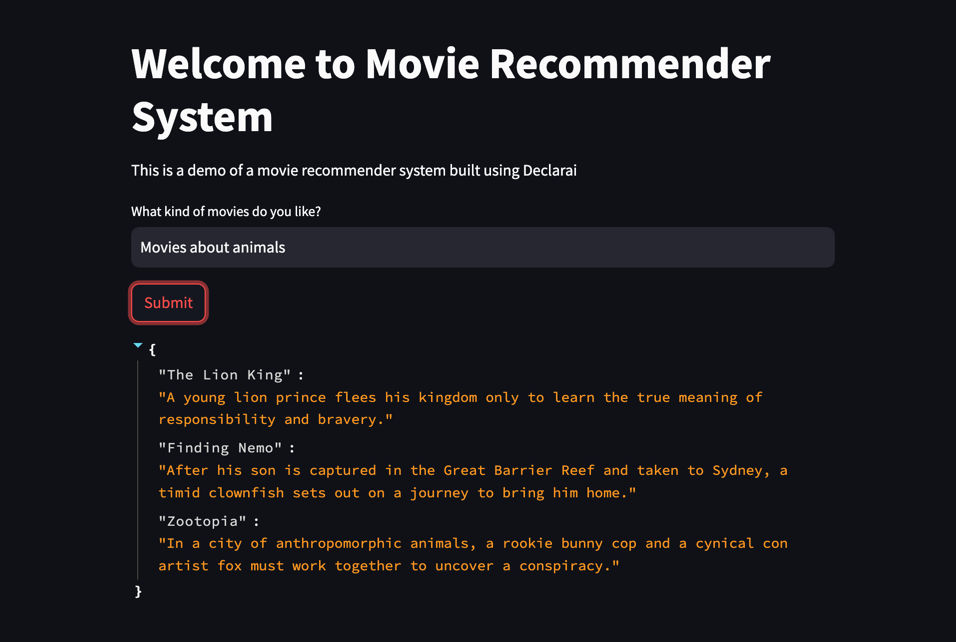

# Deployments ⚒️
Ready to deploy your code? Here are some resources to help you get started:


## FastAPI
Deploying business logic as a REST API is a common pattern. **FastAPI** is an ultimate solution.
Here's how you can deploy your Declarai code behind a REST API using FastAPI:

```python
from typing import Dict
from pydantic import BaseModel
from fastapi import FastAPI, APIRouter
from declarai import Declarai

app = FastAPI()
router = APIRouter()
declarai = Declarai(provider="openai", model="gpt-3.5-turbo")


@declarai.task
def movie_recommender(user_input: str) -> Dict[str, str]:
    """
    Recommend a selection of real movies to watch based on the user input
    For each movie provide its name and a short description as well.
    :param user_input: The user's input
    :return: A mapping between movie names and descriptions
    """


class MovieRecommendationRequest(BaseModel):
    user_input: str


@router.post("/movie_recommender", response_model=Dict[str, str])
def run_movie_recommender(request: MovieRecommendationRequest) -> Dict[str, str]:
    """
    Run the movie recommender task behind a post request
    """
    return movie_recommender(user_input=request.user_input)


app.include_router(router)

if __name__ == "__main__":
    import uvicorn

    uvicorn.run(app)
```

You can now run the server with `python app.py` and send a POST request to `http://localhost:8000/movie_recommender`:


```python
import requests

res = requests.post("http://localhost:8000/movie_recommender",
              json={"user_input": "I want to watch a movie about space"})
>>> res.json()

{'Gravity': 'Two astronauts work together to survive after an accident leaves '
            'them stranded in space.',
 'Interstellar': 'A team of explorers travel through a wormhole in space in an '
                 "attempt to ensure humanity's survival.",
 'The Martian': 'An astronaut is left stranded on Mars and must find a way to '
                'survive until rescue is possible.'}

```

## Streamlit app
Streamlit is a great tool for quickly building interactive web apps.
Assuming you have deployed your Declarai code as a REST API, you can use the following snippet to build a Streamlit app that interacts with it:
```python
import streamlit as st
import requests

BACKEND_URL = "http://localhost:8000"
st.title("Welcome to Movie Recommender System")
st.write("This is a demo of a movie recommender system built using Declarai")

user_input = st.text_input("What kind of movies do you like?")
button = st.button("Submit")
if button:
    print(user_input)
    with st.spinner("Thinking.."):
        res = requests.post(f"{BACKEND_URL}/movie_recommender", json={"user_input": user_input})
    st.write(res.json())
```



