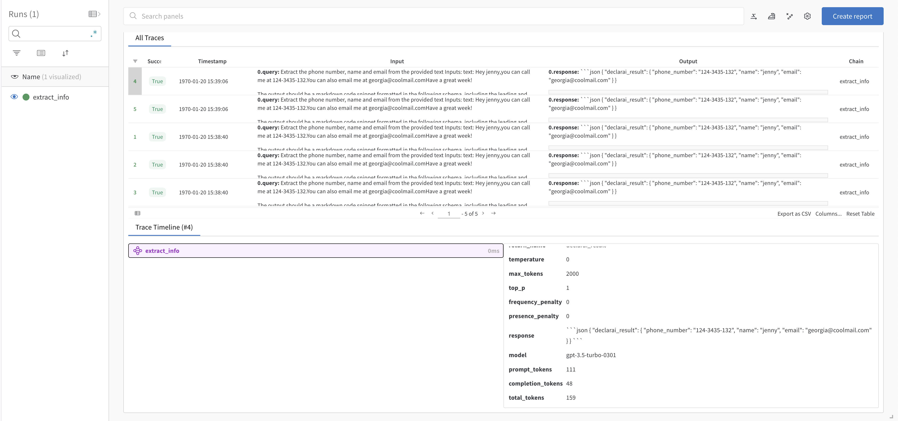

# Integrations

Declarai comes with minimal dependencies out of the box, to keep the core of the library clean and simple.
If you would like to extend the functionality of Declarai, you can install one of the following integrations.

## [Wandb](https://wandb.ai/site)

Weights & Biases is a popular tool for tracking machine learning experiments.
Recently they have provided an API for their tracking prompts in their platform.
The platform has a free tier which you can use to experiment!

```bash
pip install declarai[wandb]
```

!!! info

     To use this integration you will need to create an account at wandb. Once created, 
     you can create a new project and get your API key from the settings page.


Once set up, you can use the `WandDBMonitorCreator` to track your prompts in the platform.

```python
from typing import Dict
from declarai import Declarai
from declarai.middlewares.third_party.wandb_monitor import WandDBMonitorCreator


declarai = Declarai(provider="openai", model="gpt-3.5-turbo")

WandDBMonitor = WandDBMonitorCreator(
    name="<context-name>",
    project="<project-name>",
    key="<your-decorators-key>",
)


@declarai.task(middlewares=[WandDBMonitor])
def extract_info(text: str) -> Dict[str, str]:
    """
    Extract the phone number, name and email from the provided text
    :param text: content to extract the info from
    :return: The info extracted from the text
    """
    return Declarai.magic(text=text)
```
The tracked prompts should look like this:
<p align="center">

</p>